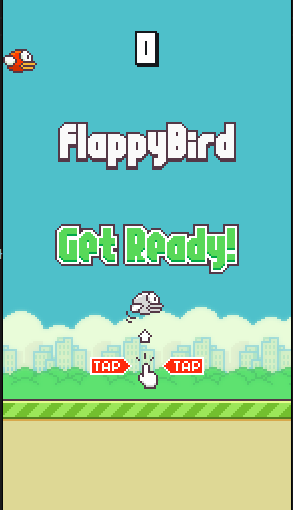

# Flappy Bird - Python Edition


## About

This project is a Python recreation of the classic Flappy Bird game. The game challenges players to control a bird and navigate through obstacles by tapping to make the bird fly. It is designed to demonstrate game development basics using Python and the Pygame library.

## Features

- **Classic Gameplay**: Tap to make the bird fly and avoid pipes.
- **Scoring System**: Track your progress with a dynamic score display.
- **Easy-to-Run**: Simple setup for Python and Pygame.

## Installation

1. Clone this repository:
   ```bash
   git clone https://github.com/yourusername/flappy-bird-python.git
    ```
2. to run the project:
    ```bash
    python3 main.py
    ```

3. Required library to run:
    ```bash
    python3.9 -m venv venv # Create a venv
    source venv/bin/activate # Activate the venv
    pip install -r requirements.txt
    ```